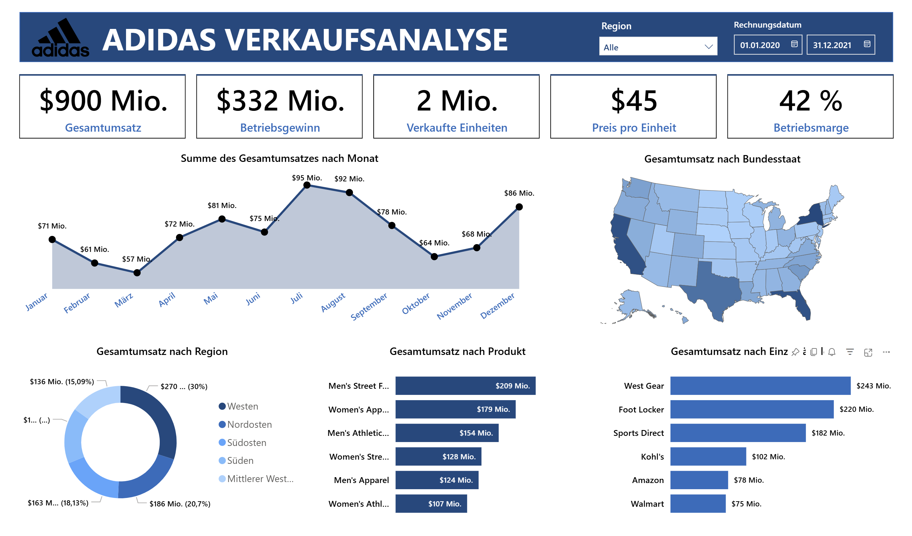

# 📖 **Sprachen:** **Deutsch** | [Türkçe](README_TR.md)

# 👟 Adidas Verkaufsanalyse-Dashboard

Dieses Projekt ist ein interaktives Power BI Dashboard, das Verkaufsdaten von Adidas aus den Jahren 2020–2021 visualisiert und analysiert. Ziel war es, aussagekräftige Einblicke in vier zentrale Bereiche zu gewinnen: die monatliche Umsatzentwicklung, die geografische Umsatzverteilung nach Bundesstaat und Region, die Umsatzleistung nach Produktkategorie sowie die Performance nach Einzelhändler. Das Dashboard ermöglicht durch interaktive Filter (Region, Rechnungsdatum) eine flexible und detaillierte Analyse.

## 📸 Screenshots

## 🛠️ Verwendete Tools

- **Power BI Desktop**
- **DAX**
- **Power Query**

## 📧 Kontakt

**Süha Çağrı Özbakışlar**

